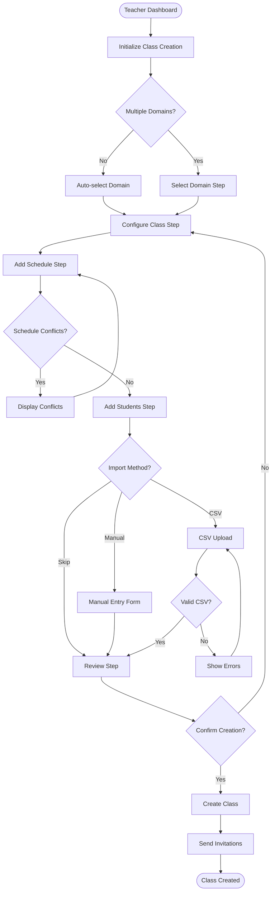

# Teacher Class Creation System - User Experience Design

## Overview

This document outlines the user experience design for the class creation wizard, including wireframes, user flows, interaction patterns, and accessibility considerations.

## Design Principles

1. **Progressive Disclosure**: Show only relevant information at each step
2. **Clear Visual Hierarchy**: Guide users through the process naturally
3. **Immediate Feedback**: Validate inputs in real-time
4. **Flexibility**: Allow users to navigate back and edit previous steps
5. **Accessibility**: WCAG 2.1 AA compliant design

## User Flow



## Wizard Structure

### Step 1: Domain Selection (Conditional)

**Shown when**: Teacher has access to multiple domains
**Auto-skipped when**: Teacher has access to only one domain

```
┌─────────────────────────────────────────┐
│ Create New Class                   [X]  │
├─────────────────────────────────────────┤
│                                         │
│ ● Domain Selection                      │
│ ○ Class Configuration                   │
│ ○ Schedule                              │
│ ○ Students                              │
│ ○ Review                                │
│                                         │
│ ─────────────────────────────────────── │
│                                         │
│ Select Teaching Domain                  │
│                                         │
│ ┌─────────────────────────────────────┐ │
│ │ 🎵 Music                         ✓  │ │
│ │    3 existing classes               │ │
│ └─────────────────────────────────────┘ │
│                                         │
│ ┌─────────────────────────────────────┐ │
│ │ 🔢 Mathematics                      │ │
│ │    1 existing class                 │ │
│ └─────────────────────────────────────┘ │
│                                         │
│ ┌─────────────────────────────────────┐ │
│ │ 🔬 Science                          │ │
│ │    No classes yet                   │ │
│ └─────────────────────────────────────┘ │
│                                         │
│                    [Continue →]         │
└─────────────────────────────────────────┘
```

### Step 2: Class Configuration

```
┌─────────────────────────────────────────┐
│ Create New Class                   [X]  │
├─────────────────────────────────────────┤
│                                         │
│ ✓ Domain Selection (Music)              │
│ ● Class Configuration                   │
│ ○ Schedule                              │
│ ○ Students                              │
│ ○ Review                                │
│                                         │
│ ─────────────────────────────────────── │
│                                         │
│ Class Name *                            │
│ ┌─────────────────────────────────────┐ │
│ │ Beginner Piano - Spring 2025        │ │
│ └─────────────────────────────────────┘ │
│                                         │
│ Description (Optional)                  │
│ ┌─────────────────────────────────────┐ │
│ │ Introduction to piano fundamentals  │ │
│ │ for absolute beginners...          │ │
│ └─────────────────────────────────────┘ │
│                                         │
│ Difficulty Level *                      │
│ ┌─────────────────────────────────────┐ │
│ │ Beginner                         ▼  │ │
│ └─────────────────────────────────────┘ │
│                                         │
│ Lesson Frequency *                      │
│ ◉ Weekly                                │
│ ○ Bi-weekly                             │
│ ○ Monthly                               │
│ ○ Custom                                │
│                                         │
│ Maximum Students                        │
│ ┌──────┐                                │
│ │  15  │  (Default: 30, Max: 50)       │
│ └──────┘                                │
│                                         │
│ ☑ Allow students to message each other  │
│                                         │
│ [← Back]              [Continue →]      │
└─────────────────────────────────────────┘
```

### Step 3: Schedule Configuration

```
┌─────────────────────────────────────────┐
│ Create New Class                   [X]  │
├─────────────────────────────────────────┤
│                                         │
│ ✓ Domain Selection (Music)              │
│ ✓ Class Configuration                   │
│ ● Schedule                              │
│ ○ Students                              │
│ ○ Review                                │
│                                         │
│ ─────────────────────────────────────── │
│                                         │
│ Add Class Schedule                      │
│                                         │
│ Schedule 1                              │
│ ┌─────────────────────────────────────┐ │
│ │ Day: [Monday      ▼]                │ │
│ │ Time: [3:00 PM] to [4:00 PM]        │ │
│ │ Timezone: America/New_York          │ │
│ │                                     │ │
│ │ Start Date: [01/15/2025]            │ │
│ │ End Date:   [05/15/2025] (Optional) │ │
│ │                     [Remove]        │ │
│ └─────────────────────────────────────┘ │
│                                         │
│ [+ Add Another Schedule]                │
│                                         │
│ ⚠ Conflict Detection                   │
│ ┌─────────────────────────────────────┐ │
│ │ ⚠ You have "Advanced Piano" on      │ │
│ │   Mondays 2:30-3:30 PM              │ │
│ │   [View Schedule] [Ignore]          │ │
│ └─────────────────────────────────────┘ │
│                                         │
│ Total Lessons: 17 (Weekly for 17 weeks) │
│                                         │
│ [← Back]              [Continue →]      │
└─────────────────────────────────────────┘
```

### Step 4: Add Students

```
┌─────────────────────────────────────────┐
│ Create New Class                   [X]  │
├─────────────────────────────────────────┤
│                                         │
│ ✓ Domain Selection (Music)              │
│ ✓ Class Configuration                   │
│ ✓ Schedule                              │
│ ● Students                              │
│ ○ Review                                │
│                                         │
│ ─────────────────────────────────────── │
│                                         │
│ Add Students to Class                   │
│                                         │
│ [Manual Entry] [Import CSV] [Skip]      │
│                                         │
│ Student 1                               │
│ ┌─────────────────────────────────────┐ │
│ │ First Name: [Emma         ]         │ │
│ │ Last Name:  [Johnson      ]         │ │
│ │ Email:      [emma@example.com    ]  │ │
│ │                     [Remove]        │ │
│ └─────────────────────────────────────┘ │
│                                         │
│ [+ Add Another Student]                 │
│                                         │
│ Custom Invitation Message (Optional)    │
│ ┌─────────────────────────────────────┐ │
│ │ Hi {firstName},                     │ │
│ │                                     │ │
│ │ You're invited to join my Beginner  │ │
│ │ Piano class starting January 15th!  │ │
│ │                                     │ │
│ │ Looking forward to teaching you!    │ │
│ └─────────────────────────────────────┘ │
│                                         │
│ Students Added: 5 / 15                  │
│                                         │
│ [← Back]              [Continue →]      │
└─────────────────────────────────────────┘
```

### Step 4b: CSV Import Modal

```
┌─────────────────────────────────────────┐
│ Import Students from CSV           [X]  │
├─────────────────────────────────────────┤
│                                         │
│ Download Template: [📥 CSV Template]    │
│                                         │
│ Upload File                             │
│ ┌─────────────────────────────────────┐ │
│ │                                     │ │
│ │     📁 Drag file here or browse     │ │
│ │                                     │ │
│ │         [Browse Files]              │ │
│ │                                     │ │
│ └─────────────────────────────────────┘ │
│                                         │
│ File: students_list.csv ✓               │
│                                         │
│ Validation Results:                     │
│ ┌─────────────────────────────────────┐ │
│ │ ✓ 23 valid entries                  │ │
│ │ ⚠ 2 duplicates found (will skip)   │ │
│ │ ✗ 1 invalid email                   │ │
│ │   Row 15: invalid@                  │ │
│ └─────────────────────────────────────┘ │
│                                         │
│ [Cancel]              [Import 23 →]     │
└─────────────────────────────────────────┘
```

### Step 5: Review and Confirm

```
┌─────────────────────────────────────────┐
│ Create New Class                   [X]  │
├─────────────────────────────────────────┤
│                                         │
│ ✓ Domain Selection (Music)              │
│ ✓ Class Configuration                   │
│ ✓ Schedule                              │
│ ✓ Students                              │
│ ● Review                                │
│                                         │
│ ─────────────────────────────────────── │
│                                         │
│ Review Class Details                    │
│                                         │
│ CLASS INFORMATION                       │
│ Name: Beginner Piano - Spring 2025      │
│ Domain: Music                           │
│ Level: Beginner                         │
│ Frequency: Weekly                       │
│ Max Students: 15                        │
│                           [Edit]        │
│                                         │
│ SCHEDULE                                │
│ Mondays 3:00-4:00 PM EST                │
│ Jan 15, 2025 - May 15, 2025            │
│ Total: 17 lessons                       │
│                           [Edit]        │
│                                         │
│ STUDENTS                                │
│ 5 students will receive invitations     │
│ • Emma Johnson                          │
│ • Michael Chen                          │
│ • Sarah Williams                        │
│ • [View All]              [Edit]        │
│                                         │
│ ☑ I confirm all details are correct     │
│                                         │
│ [← Back]            [Create Class →]    │
└─────────────────────────────────────────┘
```

## Success State

```
┌─────────────────────────────────────────┐
│ Class Created Successfully!        [X]  │
├─────────────────────────────────────────┤
│                                         │
│         ✅ Success!                     │
│                                         │
│ "Beginner Piano - Spring 2025" has been │
│ created successfully.                   │
│                                         │
│ • 5 invitation emails sent              │
│ • Class page is now live                │
│ • First lesson: Mon, Jan 15 at 3:00 PM  │
│                                         │
│ What's Next?                            │
│                                         │
│ [View Class]  [Add More Students]       │
│ [Create Another Class]  [Dashboard]     │
│                                         │
└─────────────────────────────────────────┘
```

## Responsive Design

### Mobile Layout (< 768px)

- Full-width wizard steps
- Stacked form fields
- Bottom sheet for schedule picker
- Swipe gestures for navigation
- Simplified table views for student lists

### Tablet Layout (768px - 1024px)

- 2-column layout for form fields
- Side-by-side schedule comparison
- Modal overlays for imports
- Touch-optimized controls

### Desktop Layout (> 1024px)

- 3-column layout where appropriate
- Inline validation messages
- Keyboard shortcuts for navigation
- Drag-and-drop for file uploads

## Interaction Patterns

### Form Validation

1. **Real-time Validation**
   - Email format checking as user types
   - Schedule conflict detection immediately
   - Name uniqueness check with debounce

2. **Error States**
   - Red border on invalid fields
   - Clear error messages below fields
   - Summary of errors at step level

3. **Success Feedback**
   - Green checkmarks for valid fields
   - Progress indication in wizard steps
   - Toast notifications for actions

### Navigation

1. **Step Navigation**
   - Click on completed steps to jump back
   - Keyboard support (Tab, Enter, Arrows)
   - Breadcrumb trail for context

2. **Data Persistence**
   - Auto-save every 30 seconds
   - LocalStorage for draft recovery
   - Warning on navigation away

### Loading States

1. **Inline Loaders**
   - Skeleton screens for data fetching
   - Progress bars for file uploads
   - Spinner overlays for submissions

2. **Optimistic Updates**
   - Show success immediately
   - Rollback on failure
   - Queue for offline actions

## Accessibility

### WCAG 2.1 AA Compliance

1. **Color Contrast**
   - 4.5:1 for normal text
   - 3:1 for large text
   - Non-color indicators for states

2. **Keyboard Navigation**
   - All interactive elements focusable
   - Logical tab order
   - Skip links for screen readers

3. **Screen Reader Support**
   - Semantic HTML structure
   - ARIA labels and descriptions
   - Live regions for updates

4. **Error Handling**
   - Clear error messages
   - Association with form fields
   - Focus management on errors

## Animation and Transitions

### Micro-animations

```css
/* Step transitions */
.wizard-step {
  transition: opacity 300ms ease-in-out,
              transform 300ms cubic-bezier(0.68, -0.55, 0.265, 1.55);
}

/* Field validation */
.form-field {
  transition: border-color 200ms ease,
              background-color 200ms ease;
}

/* Success state */
@keyframes checkmark {
  0% { stroke-dashoffset: 50; }
  100% { stroke-dashoffset: 0; }
}
```

### Page Transitions

- Slide between wizard steps
- Fade in/out for modals
- Expand/collapse for accordions
- Smooth scroll to errors

## Component Library Integration

The design leverages existing shadcn/ui components:

1. **Form Components**
   - `Form`, `FormField`, `FormItem`
   - `Input`, `Select`, `Textarea`
   - `DatePicker`, `TimePicker`

2. **Layout Components**
   - `Card` for wizard container
   - `Separator` between sections
   - `ScrollArea` for long lists

3. **Feedback Components**
   - `Toast` for notifications
   - `Alert` for warnings
   - `Progress` for step indicator

4. **Interaction Components**
   - `Button` with variants
   - `Checkbox`, `RadioGroup`
   - `Dialog` for modals

## Design Tokens

```typescript
// Color Palette
const colors = {
  primary: "hsl(221, 83%, 53%)",     // Blue
  success: "hsl(142, 71%, 45%)",     // Green
  warning: "hsl(38, 92%, 50%)",      // Amber
  error: "hsl(0, 84%, 60%)",         // Red
  neutral: {
    50: "hsl(210, 40%, 98%)",
    100: "hsl(210, 40%, 96%)",
    200: "hsl(214, 32%, 91%)",
    300: "hsl(213, 27%, 84%)",
    400: "hsl(215, 20%, 65%)",
    500: "hsl(215, 16%, 47%)",
    600: "hsl(215, 19%, 35%)",
    700: "hsl(214, 24%, 26%)",
    800: "hsl(217, 33%, 17%)",
    900: "hsl(222, 47%, 11%)"
  }
};

// Typography
const typography = {
  heading: {
    1: { size: "2.5rem", weight: 700, lineHeight: 1.2 },
    2: { size: "2rem", weight: 600, lineHeight: 1.3 },
    3: { size: "1.5rem", weight: 600, lineHeight: 1.4 },
    4: { size: "1.25rem", weight: 500, lineHeight: 1.5 }
  },
  body: {
    large: { size: "1.125rem", weight: 400, lineHeight: 1.6 },
    regular: { size: "1rem", weight: 400, lineHeight: 1.5 },
    small: { size: "0.875rem", weight: 400, lineHeight: 1.5 }
  }
};

// Spacing
const spacing = {
  xs: "0.25rem",   // 4px
  sm: "0.5rem",    // 8px
  md: "1rem",      // 16px
  lg: "1.5rem",    // 24px
  xl: "2rem",      // 32px
  xxl: "3rem"      // 48px
};
```

## Testing Considerations

### Usability Testing Scenarios

1. **First-time User**
   - Complete class creation in under 3 minutes
   - Understand each step without help
   - Successfully invite 5 students

2. **Power User**
   - Create multiple classes efficiently
   - Use keyboard shortcuts
   - Bulk import 30+ students

3. **Error Recovery**
   - Handle network failures gracefully
   - Recover from validation errors
   - Resume interrupted sessions

### A/B Testing Opportunities

1. **Step Order**
   - Schedule before/after students
   - Combined vs separate configuration

2. **Import Methods**
   - CSV vs copy-paste
   - Email list parsing

3. **Confirmation**
   - Single review vs per-step confirmation
   - Preview mode vs summary