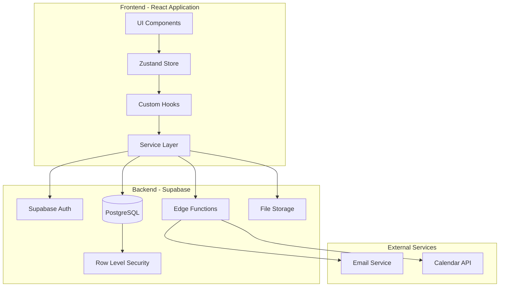

# Teacher Class Creation System - Technical Architecture

## Overview

This document defines the technical architecture, component structure, API design, and state management for the class creation system within the existing React/TypeScript/Supabase stack.

## System Architecture



## Component Architecture

### Directory Structure

```
src/
├── components/
│   └── class-creation/
│       ├── ClassCreationWizard.tsx
│       ├── steps/
│       │   ├── DomainSelectionStep.tsx
│       │   ├── ClassConfigurationStep.tsx
│       │   ├── ScheduleConfigurationStep.tsx
│       │   ├── StudentManagementStep.tsx
│       │   └── ReviewConfirmStep.tsx
│       ├── forms/
│       │   ├── ClassDetailsForm.tsx
│       │   ├── ScheduleForm.tsx
│       │   ├── StudentEntryForm.tsx
│       │   └── BulkImportForm.tsx
│       ├── ui/
│       │   ├── ScheduleCalendar.tsx
│       │   ├── ConflictAlert.tsx
│       │   ├── StudentList.tsx
│       │   └── WizardProgress.tsx
│       └── modals/
│           ├── CSVImportModal.tsx
│           ├── ScheduleConflictModal.tsx
│           └── ConfirmationModal.tsx
├── hooks/
│   └── class-creation/
│       ├── useClassWizard.ts
│       ├── useScheduleConflicts.ts
│       ├── useStudentValidation.ts
│       └── useBulkImport.ts
├── services/
│   └── class-creation/
│       ├── class.service.ts
│       ├── schedule.service.ts
│       ├── student.service.ts
│       └── invitation.service.ts
├── stores/
│   └── class-creation/
│       └── classWizard.store.ts
├── types/
│   └── class-creation/
│       ├── class.types.ts
│       ├── schedule.types.ts
│       └── student.types.ts
└── utils/
    └── class-creation/
        ├── validation.ts
        ├── csv-parser.ts
        └── schedule-helpers.ts
```

## State Management

### Zustand Store Definition

```typescript
// stores/class-creation/classWizard.store.ts

import { create } from 'zustand';
import { devtools, persist } from 'zustand/middleware';
import { immer } from 'zustand/middleware/immer';

export type WizardStep = 
  | 'domain'
  | 'configuration'
  | 'schedule'
  | 'students'
  | 'review';

interface ClassFormData {
  // Domain Selection
  domainId: string | null;
  
  // Class Configuration
  name: string;
  description: string;
  difficultyLevelId: string | null;
  lessonFrequency: 'weekly' | 'bi_weekly' | 'monthly' | 'custom';
  maxStudents: number;
  allowStudentMessaging: boolean;
  
  // Schedule
  schedules: ScheduleEntry[];
  
  // Students
  students: StudentEntry[];
  invitationMessage: string;
  
  // Metadata
  tenantId: string;
  teacherId: string;
}

interface ScheduleEntry {
  id: string;
  dayOfWeek: number;
  startTime: string;
  endTime: string;
  timezone: string;
  startDate: string;
  endDate?: string;
  recurrencePattern: 'weekly' | 'bi_weekly' | 'monthly';
}

interface StudentEntry {
  id: string;
  email: string;
  firstName: string;
  lastName: string;
  status: 'pending' | 'valid' | 'invalid' | 'duplicate';
  errorMessage?: string;
}

interface ValidationErrors {
  [key: string]: string[];
}

interface ClassWizardStore {
  // State
  isOpen: boolean;
  currentStep: WizardStep;
  completedSteps: Set<WizardStep>;
  formData: ClassFormData;
  validationErrors: ValidationErrors;
  isLoading: boolean;
  isSaving: boolean;
  
  // Draft Management
  draftId: string | null;
  lastSavedAt: Date | null;
  hasUnsavedChanges: boolean;
  
  // Actions - Navigation
  openWizard: () => void;
  closeWizard: () => void;
  setCurrentStep: (step: WizardStep) => void;
  goToNextStep: () => void;
  goToPreviousStep: () => void;
  
  // Actions - Form Data
  updateFormField: <K extends keyof ClassFormData>(
    field: K,
    value: ClassFormData[K]
  ) => void;
  addSchedule: (schedule: Omit<ScheduleEntry, 'id'>) => void;
  updateSchedule: (id: string, schedule: Partial<ScheduleEntry>) => void;
  removeSchedule: (id: string) => void;
  addStudent: (student: Omit<StudentEntry, 'id'>) => void;
  updateStudent: (id: string, student: Partial<StudentEntry>) => void;
  removeStudent: (id: string) => void;
  importStudents: (students: Omit<StudentEntry, 'id'>[]) => void;
  
  // Actions - Validation
  validateStep: (step: WizardStep) => Promise<boolean>;
  clearValidationErrors: (field?: string) => void;
  
  // Actions - Persistence
  saveDraft: () => Promise<void>;
  loadDraft: (draftId: string) => Promise<void>;
  clearDraft: () => void;
  
  // Actions - Submission
  createClass: () => Promise<{ success: boolean; classId?: string; error?: string }>;
  reset: () => void;
}

export const useClassWizardStore = create<ClassWizardStore>()(
  devtools(
    persist(
      immer((set, get) => ({
        // Initial State
        isOpen: false,
        currentStep: 'domain',
        completedSteps: new Set(),
        formData: {
          domainId: null,
          name: '',
          description: '',
          difficultyLevelId: null,
          lessonFrequency: 'weekly',
          maxStudents: 30,
          allowStudentMessaging: true,
          schedules: [],
          students: [],
          invitationMessage: '',
          tenantId: '',
          teacherId: '',
        },
        validationErrors: {},
        isLoading: false,
        isSaving: false,
        draftId: null,
        lastSavedAt: null,
        hasUnsavedChanges: false,
        
        // Implementation of actions...
        openWizard: () => set(state => {
          state.isOpen = true;
        }),
        
        closeWizard: () => set(state => {
          if (state.hasUnsavedChanges) {
            // Trigger confirmation dialog
            const confirmed = window.confirm('You have unsaved changes. Are you sure?');
            if (!confirmed) return;
          }
          state.isOpen = false;
        }),
        
        // ... rest of implementation
      })),
      {
        name: 'class-wizard-storage',
        partialize: (state) => ({
          formData: state.formData,
          currentStep: state.currentStep,
          completedSteps: Array.from(state.completedSteps),
        }),
      }
    )
  )
);
```

## API Design

### RESTful Endpoints (via Supabase RPC)

```typescript
// Supabase Edge Functions

// 1. Check Schedule Conflicts
interface CheckScheduleConflictsRequest {
  teacherId: string;
  schedules: Array<{
    dayOfWeek: number;
    startTime: string;
    endTime: string;
    startDate: string;
    endDate?: string;
  }>;
}

interface CheckScheduleConflictsResponse {
  hasConflicts: boolean;
  conflicts: Array<{
    classId: string;
    className: string;
    conflictingSchedule: {
      dayOfWeek: number;
      startTime: string;
      endTime: string;
    };
  }>;
}

// 2. Validate Students
interface ValidateStudentsRequest {
  students: Array<{
    email: string;
    firstName: string;
    lastName: string;
  }>;
  classId?: string; // For checking duplicates within class
}

interface ValidateStudentsResponse {
  valid: StudentEntry[];
  invalid: Array<StudentEntry & { reason: string }>;
  duplicates: Array<StudentEntry & { existingClassId?: string }>;
}

// 3. Create Class with Students
interface CreateClassRequest {
  class: {
    name: string;
    description?: string;
    domainId: string;
    difficultyLevelId: string;
    lessonFrequency: string;
    maxStudents: number;
    allowStudentMessaging: boolean;
  };
  schedules: ScheduleEntry[];
  students: Array<{
    email: string;
    firstName: string;
    lastName: string;
  }>;
  invitationMessage?: string;
}

interface CreateClassResponse {
  classId: string;
  invitationsSent: number;
  errors?: string[];
}
```

### Service Layer Implementation

```typescript
// services/class-creation/class.service.ts

import { supabase } from '@/integrations/supabase/client';
import { 
  CreateClassRequest, 
  CreateClassResponse,
  ClassFormData 
} from '@/types/class-creation';

export class ClassService {
  /**
   * Create a new class with all related data
   */
  static async createClass(data: ClassFormData): Promise<CreateClassResponse> {
    try {
      // Start a Supabase transaction
      const { data: result, error } = await supabase.rpc('create_class_with_students', {
        p_class: {
          name: data.name,
          description: data.description,
          domain_id: data.domainId,
          difficulty_level_id: data.difficultyLevelId,
          lesson_frequency: data.lessonFrequency,
          max_students: data.maxStudents,
          allow_student_messaging: data.allowStudentMessaging,
          tenant_id: data.tenantId,
          teacher_id: data.teacherId,
        },
        p_schedules: data.schedules.map(s => ({
          day_of_week: s.dayOfWeek,
          start_time: s.startTime,
          end_time: s.endTime,
          timezone: s.timezone,
          start_date: s.startDate,
          end_date: s.endDate,
          recurrence_pattern: s.recurrencePattern,
        })),
        p_students: data.students.map(s => ({
          email: s.email,
          first_name: s.firstName,
          last_name: s.lastName,
        })),
        p_invitation_message: data.invitationMessage,
      });

      if (error) throw error;

      return {
        classId: result.class_id,
        invitationsSent: result.invitations_sent,
      };
    } catch (error) {
      console.error('Failed to create class:', error);
      throw new Error('Failed to create class. Please try again.');
    }
  }

  /**
   * Save class draft for later
   */
  static async saveDraft(data: ClassFormData): Promise<string> {
    const { data: draft, error } = await supabase
      .from('class_drafts')
      .upsert({
        teacher_id: data.teacherId,
        tenant_id: data.tenantId,
        draft_data: data,
        updated_at: new Date().toISOString(),
      })
      .select('id')
      .single();

    if (error) throw error;
    return draft.id;
  }

  /**
   * Load saved draft
   */
  static async loadDraft(draftId: string): Promise<ClassFormData | null> {
    const { data, error } = await supabase
      .from('class_drafts')
      .select('draft_data')
      .eq('id', draftId)
      .single();

    if (error || !data) return null;
    return data.draft_data as ClassFormData;
  }

  /**
   * Get teacher's domains
   */
  static async getTeacherDomains(teacherId: string) {
    const { data, error } = await supabase
      .from('teacher_domains')
      .select(`
        domain_id,
        domains (
          id,
          name,
          description,
          icon_name
        )
      `)
      .eq('teacher_id', teacherId);

    if (error) throw error;
    return data?.map(td => td.domains) || [];
  }
}
```

### Custom Hooks

```typescript
// hooks/class-creation/useClassWizard.ts

import { useEffect, useCallback } from 'react';
import { useClassWizardStore } from '@/stores/class-creation';
import { ClassService } from '@/services/class-creation';
import { useAuth } from '@/hooks/useAuth';
import { useToast } from '@/components/ui/use-toast';

export function useClassWizard() {
  const { user, currentTenant } = useAuth();
  const { toast } = useToast();
  const store = useClassWizardStore();

  // Initialize wizard with user context
  useEffect(() => {
    if (user && currentTenant) {
      store.updateFormField('teacherId', user.id);
      store.updateFormField('tenantId', currentTenant.id);
    }
  }, [user, currentTenant]);

  // Auto-save draft
  useEffect(() => {
    if (!store.hasUnsavedChanges) return;

    const timeoutId = setTimeout(async () => {
      try {
        await store.saveDraft();
        toast({
          title: 'Draft saved',
          description: 'Your progress has been saved',
        });
      } catch (error) {
        console.error('Failed to save draft:', error);
      }
    }, 30000); // 30 seconds

    return () => clearTimeout(timeoutId);
  }, [store.hasUnsavedChanges, store.formData]);

  // Handle step validation
  const validateCurrentStep = useCallback(async () => {
    const isValid = await store.validateStep(store.currentStep);
    
    if (!isValid) {
      toast({
        title: 'Validation Error',
        description: 'Please fix the errors before continuing',
        variant: 'destructive',
      });
    }
    
    return isValid;
  }, [store.currentStep]);

  // Handle class creation
  const handleCreateClass = useCallback(async () => {
    try {
      store.setLoading(true);
      
      const result = await store.createClass();
      
      if (result.success) {
        toast({
          title: 'Success!',
          description: 'Class created successfully',
        });
        
        // Navigate to class page
        window.location.href = `/teacher/classes/${result.classId}`;
      } else {
        throw new Error(result.error);
      }
    } catch (error) {
      toast({
        title: 'Error',
        description: error.message,
        variant: 'destructive',
      });
    } finally {
      store.setLoading(false);
    }
  }, [store, toast]);

  return {
    ...store,
    validateCurrentStep,
    handleCreateClass,
  };
}
```

## Database Functions

### Stored Procedures

```sql
-- Create class with all related data in a transaction
CREATE OR REPLACE FUNCTION create_class_with_students(
  p_class jsonb,
  p_schedules jsonb,
  p_students jsonb,
  p_invitation_message text
) RETURNS jsonb AS $$
DECLARE
  v_class_id uuid;
  v_student_count integer := 0;
  v_invitation_count integer := 0;
BEGIN
  -- Insert class
  INSERT INTO classes (
    tenant_id, domain_id, teacher_id, name, description,
    difficulty_level_id, lesson_frequency, max_students, 
    allow_student_messaging
  )
  SELECT 
    (p_class->>'tenant_id')::uuid,
    (p_class->>'domain_id')::uuid,
    (p_class->>'teacher_id')::uuid,
    p_class->>'name',
    p_class->>'description',
    (p_class->>'difficulty_level_id')::uuid,
    p_class->>'lesson_frequency',
    (p_class->>'max_students')::integer,
    (p_class->>'allow_student_messaging')::boolean
  RETURNING id INTO v_class_id;

  -- Insert schedules
  INSERT INTO class_schedules (
    class_id, day_of_week, start_time, end_time, 
    timezone, start_date, end_date, recurrence_pattern
  )
  SELECT 
    v_class_id,
    (schedule->>'day_of_week')::integer,
    (schedule->>'start_time')::time,
    (schedule->>'end_time')::time,
    schedule->>'timezone',
    (schedule->>'start_date')::date,
    (schedule->>'end_date')::date,
    schedule->>'recurrence_pattern'
  FROM jsonb_array_elements(p_schedules) AS schedule;

  -- Insert students and create invitations
  WITH inserted_students AS (
    INSERT INTO class_students (
      class_id, invited_email, invited_first_name, 
      invited_last_name, invited_by, invitation_message
    )
    SELECT 
      v_class_id,
      student->>'email',
      student->>'first_name',
      student->>'last_name',
      (p_class->>'teacher_id')::uuid,
      p_invitation_message
    FROM jsonb_array_elements(p_students) AS student
    RETURNING id
  )
  SELECT COUNT(*) INTO v_student_count FROM inserted_students;

  -- Create invitation records
  INSERT INTO class_invitations (class_student_id)
  SELECT id FROM class_students 
  WHERE class_id = v_class_id;

  -- Queue email sending (handled by Edge Function)
  PERFORM net.http_post(
    url := 'https://project.supabase.co/functions/v1/send-invitations',
    body := jsonb_build_object('class_id', v_class_id)
  );

  RETURN jsonb_build_object(
    'class_id', v_class_id,
    'invitations_sent', v_student_count
  );
END;
$$ LANGUAGE plpgsql SECURITY DEFINER;
```

## Error Handling

### Error Boundary Component

```typescript
// components/class-creation/ErrorBoundary.tsx

import React from 'react';
import { Alert, AlertDescription } from '@/components/ui/alert';
import { Button } from '@/components/ui/button';

interface ErrorBoundaryState {
  hasError: boolean;
  error: Error | null;
}

export class ClassCreationErrorBoundary extends React.Component<
  { children: React.ReactNode },
  ErrorBoundaryState
> {
  constructor(props) {
    super(props);
    this.state = { hasError: false, error: null };
  }

  static getDerivedStateFromError(error: Error) {
    return { hasError: true, error };
  }

  componentDidCatch(error: Error, errorInfo: React.ErrorInfo) {
    console.error('Class creation error:', error, errorInfo);
    
    // Log to monitoring service
    if (window.Sentry) {
      window.Sentry.captureException(error);
    }
  }

  render() {
    if (this.state.hasError) {
      return (
        <Alert variant="destructive">
          <AlertDescription>
            Something went wrong while creating your class. 
            Please try again or contact support if the issue persists.
          </AlertDescription>
          <Button 
            onClick={() => window.location.reload()}
            className="mt-4"
          >
            Reload Page
          </Button>
        </Alert>
      );
    }

    return this.props.children;
  }
}
```

## Performance Optimizations

### 1. Code Splitting

```typescript
// Lazy load wizard components
const ClassCreationWizard = lazy(() => 
  import('./components/class-creation/ClassCreationWizard')
);
```

### 2. Memoization

```typescript
// Memoize expensive computations
const scheduleConflicts = useMemo(() => 
  checkScheduleConflicts(schedules, existingClasses),
  [schedules, existingClasses]
);
```

### 3. Debouncing

```typescript
// Debounce validation
const debouncedValidation = useMemo(
  () => debounce(validateField, 500),
  []
);
```

### 4. Virtual Scrolling

```typescript
// Use virtual scrolling for large student lists
import { VirtualList } from '@tanstack/react-virtual';
```

## Security Considerations

### 1. Input Validation

```typescript
// Validation schemas using Zod
import { z } from 'zod';

const ClassSchema = z.object({
  name: z.string().min(3).max(255),
  description: z.string().max(1000).optional(),
  domainId: z.string().uuid(),
  difficultyLevelId: z.string().uuid(),
  lessonFrequency: z.enum(['weekly', 'bi_weekly', 'monthly', 'custom']),
  maxStudents: z.number().min(1).max(100),
  allowStudentMessaging: z.boolean(),
});

const StudentSchema = z.object({
  email: z.string().email(),
  firstName: z.string().min(1).max(100),
  lastName: z.string().min(1).max(100),
});
```

### 2. CSRF Protection

```typescript
// Include CSRF token in requests
const csrfToken = await supabase.auth.getSession()
  .then(s => s.data.session?.access_token);
```

### 3. Rate Limiting

```typescript
// Implement rate limiting for invitations
const rateLimiter = {
  maxInvitations: 100,
  timeWindow: 86400000, // 24 hours
  
  canSendInvitation: async (teacherId: string) => {
    const count = await getInvitationCount(teacherId);
    return count < rateLimiter.maxInvitations;
  }
};
```

## Testing Strategy

### Unit Tests

```typescript
// __tests__/class.service.test.ts
describe('ClassService', () => {
  it('should create class with valid data', async () => {
    const mockData = createMockClassData();
    const result = await ClassService.createClass(mockData);
    expect(result.classId).toBeDefined();
  });

  it('should handle schedule conflicts', async () => {
    const conflictingSchedule = createConflictingSchedule();
    await expect(ClassService.checkConflicts(conflictingSchedule))
      .rejects.toThrow('Schedule conflict detected');
  });
});
```

### Integration Tests

```typescript
// __tests__/ClassCreationWizard.integration.test.tsx
describe('Class Creation Wizard Integration', () => {
  it('should complete full wizard flow', async () => {
    render(<ClassCreationWizard />);
    
    // Step through wizard
    await fillDomainStep();
    await fillConfigurationStep();
    await fillScheduleStep();
    await fillStudentStep();
    
    // Submit
    const submitButton = screen.getByText('Create Class');
    await userEvent.click(submitButton);
    
    // Verify success
    await waitFor(() => {
      expect(screen.getByText('Class created successfully')).toBeInTheDocument();
    });
  });
});
```

### E2E Tests

```typescript
// e2e/class-creation.spec.ts
test('teacher can create class', async ({ page }) => {
  await page.goto('/teacher/classes/new');
  
  // Complete wizard
  await page.fill('[name="className"]', 'Test Class');
  await page.selectOption('[name="difficulty"]', 'beginner');
  // ... continue through steps
  
  await page.click('button:has-text("Create Class")');
  
  // Verify redirect to class page
  await expect(page).toHaveURL(/\/teacher\/classes\/[a-z0-9-]+/);
});
```

## Monitoring and Analytics

### Event Tracking

```typescript
// Track wizard events
const trackEvent = (event: string, properties?: Record<string, any>) => {
  if (window.analytics) {
    window.analytics.track(event, {
      ...properties,
      timestamp: new Date().toISOString(),
      userId: user?.id,
      tenantId: currentTenant?.id,
    });
  }
};

// Usage
trackEvent('class_wizard_started');
trackEvent('class_wizard_step_completed', { step: 'configuration' });
trackEvent('class_created', { classId, studentCount });
```

### Performance Monitoring

```typescript
// Monitor API performance
const withPerformanceTracking = async (
  operation: string,
  fn: () => Promise<any>
) => {
  const start = performance.now();
  
  try {
    const result = await fn();
    const duration = performance.now() - start;
    
    // Log to monitoring service
    console.log(`${operation} completed in ${duration}ms`);
    
    return result;
  } catch (error) {
    const duration = performance.now() - start;
    console.error(`${operation} failed after ${duration}ms`, error);
    throw error;
  }
};
```