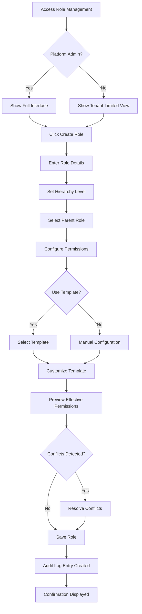
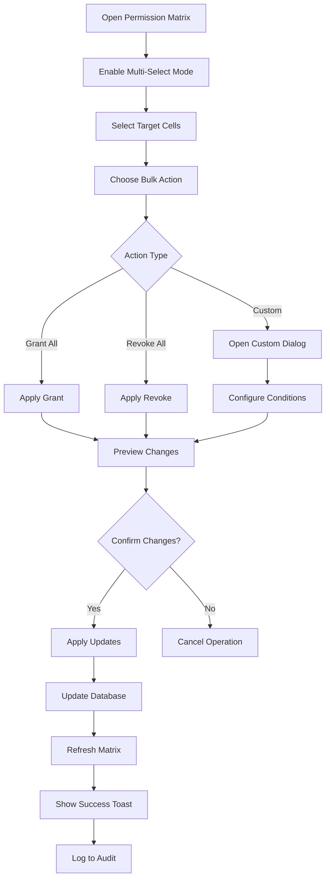

# UX Design Package: Centralized Access Management System
## Gemeos Educational Platform

### Version 1.0 | Date: 2025-09-04
### Designed for: Platform Admin, Tenant Admin, and User Access Control

---

## 1. Executive Summary

This UX Design Package provides comprehensive specifications for implementing a centralized Access Management System for the Gemeos educational platform. The design focuses on creating an intuitive, scalable, and secure interface that simplifies complex permission management while maintaining strict security standards and auditability requirements.

### Core Design Principles
- **Simplicity through Progressive Disclosure**: Complex features revealed only when needed
- **Visual Clarity**: Permission matrices and hierarchies presented through clear visual representations
- **Security-First**: All sensitive operations require confirmation and are logged
- **Accessibility Compliance**: WCAG 2.1 AA standard throughout
- **Consistency**: Leverages existing Gemeos design system (#110D59 primary color)

---

## 2. Information Architecture

### 2.1 Navigation Structure

```
/admin/access-management (NEW - Main Hub)
├── /overview (Dashboard)
├── /roles (Role Management)
│   ├── /list
│   ├── /create
│   └── /:roleId
│       ├── /edit
│       ├── /permissions
│       └── /users
├── /permissions (Permission Matrix)
│   ├── /matrix-view
│   ├── /resource-view
│   └── /bulk-edit
├── /pages (Enhanced Page Permissions)
│   ├── /list
│   └── /batch-update
├── /users (User Role Assignment)
│   ├── /list
│   └── /:userId/roles
├── /audit (Audit Logs)
│   ├── /recent
│   ├── /search
│   └── /export
└── /templates (Permission Templates)
    ├── /library
    └── /create
```

### 2.2 Component Hierarchy

```
AccessManagementSystem
├── AccessDashboard
│   ├── SystemHealthCard
│   ├── RecentActivityFeed
│   ├── QuickActions
│   └── PermissionStats
├── RoleManagement
│   ├── RoleHierarchyTree
│   ├── RoleEditor
│   ├── RolePermissionMatrix
│   └── RoleUserList
├── PermissionMatrix
│   ├── MatrixGrid
│   ├── FilterPanel
│   ├── BulkActionBar
│   └── ConflictResolver
├── PageAccessControl
│   ├── PageList (Enhanced existing)
│   ├── RoutePatternManager
│   ├── BatchPermissionEditor
│   └── PreviewPanel
├── UserRoleAssignment
│   ├── UserSearchBar
│   ├── RoleAssignmentPanel
│   ├── TenantContextSelector
│   └── EffectivePermissionsViewer
├── AuditLogViewer
│   ├── LogTimeline
│   ├── FilterControls
│   ├── DetailModal
│   └── ExportManager
└── TemplateManager
    ├── TemplateLibrary
    ├── TemplateEditor
    └── ApplicationWizard
```

---

## 3. User Journey Maps

### 3.1 Platform Admin Journey: Setting Up New Tenant Permissions

**Persona**: Sarah, Platform Administrator
**Goal**: Configure permissions for a new educational institution

**Journey Steps**:

1. **Entry Point**
   - Accesses `/admin/access-management`
   - Views system-wide dashboard
   - Emotional State: Confident, in control

2. **Template Selection**
   - Navigates to Templates library
   - Selects "Educational Institution Standard" template
   - Reviews pre-configured permissions
   - Emotional State: Efficient, time-saving

3. **Customization**
   - Opens Permission Matrix
   - Adjusts specific permissions for tenant needs
   - Uses drag-and-drop to reorganize role hierarchy
   - Emotional State: Focused, empowered

4. **Validation**
   - System highlights potential conflicts
   - Reviews effective permissions preview
   - Emotional State: Assured, careful

5. **Application**
   - Applies configuration to tenant
   - Receives confirmation with audit log entry
   - Emotional State: Satisfied, accomplished

**Pain Points Addressed**:
- Complex manual configuration eliminated
- Visual feedback prevents errors
- Audit trail provides accountability

### 3.2 Tenant Admin Journey: Managing Teacher Permissions

**Persona**: Michael, School Administrator
**Goal**: Grant curriculum management access to new teachers

**Journey Steps**:

1. **Access Control**
   - Limited view of `/admin/access-management`
   - Sees only tenant-specific controls
   - Emotional State: Focused, clear boundaries

2. **User Selection**
   - Searches for teacher by name/email
   - Views current role assignments
   - Emotional State: Informed, prepared

3. **Role Assignment**
   - Selects "Teacher" role from dropdown
   - Adds specific domain permissions
   - Views permission inheritance tree
   - Emotional State: Confident, methodical

4. **Confirmation**
   - Reviews changes in preview panel
   - Confirms with 2FA (if enabled)
   - Emotional State: Secure, responsible

5. **Communication**
   - System sends notification to affected user
   - Audit log captures change
   - Emotional State: Complete, transparent

### 3.3 Regular User Journey: Viewing Own Permissions

**Persona**: Emma, Teacher
**Goal**: Understand what resources she can access

**Journey Steps**:

1. **Discovery**
   - Finds "My Permissions" in user menu
   - Read-only view opens
   - Emotional State: Curious, seeking clarity

2. **Exploration**
   - Views permission categories
   - Expands sections for details
   - Emotional State: Learning, understanding

3. **Context**
   - Sees role inheritance explanation
   - Understands permission sources
   - Emotional State: Informed, clear

---

## 4. Wireframe Specifications

### 4.1 Access Management Dashboard

```
┌─────────────────────────────────────────────────────────────┐
│ [←] Access Management                                    [?] │
├─────────────────────────────────────────────────────────────┤
│                                                             │
│  System Overview                                           │
│  ┌──────────────┐ ┌──────────────┐ ┌──────────────┐      │
│  │ Active Users │ │ Total Roles  │ │ Permissions  │      │
│  │     1,247    │ │      12      │ │     384      │      │
│  └──────────────┘ └──────────────┘ └──────────────┘      │
│                                                             │
│  Quick Actions                                             │
│  ┌────────────────────────────────────────────────┐       │
│  │ [+ Create Role] [⚙ Bulk Update] [📋 Templates] │       │
│  └────────────────────────────────────────────────┘       │
│                                                             │
│  Recent Activity                    Permission Health      │
│  ┌─────────────────────┐          ┌──────────────────┐    │
│  │ • Admin role edited │          │ ⚠ 3 Conflicts    │    │
│  │   by john@...       │          │ ✓ 98% Coverage   │    │
│  │   2 min ago         │          │ 🔄 5 Pending     │    │
│  │                     │          └──────────────────┘    │
│  │ • Teacher permiss.. │                                   │
│  │   updated           │          Role Hierarchy          │
│  │   15 min ago        │          ┌──────────────────┐    │
│  │                     │          │ Platform Admin    │    │
│  │ [View All →]        │          │   └─Tenant Admin │    │
│  └─────────────────────┘          │      └─Teacher   │    │
│                                    │        └─Student │    │
│                                    └──────────────────┘    │
└─────────────────────────────────────────────────────────────┘
```

**Component Specifications**:
- **Header**: Breadcrumb navigation, help icon
- **Metrics Cards**: Real-time counts with subtle animations
- **Quick Actions**: Primary CTAs, uses Button variant="default"
- **Activity Feed**: Chronological, auto-refreshes every 30s
- **Permission Health**: Visual indicators using semantic colors
- **Role Hierarchy**: Interactive tree, expandable nodes

### 4.2 Permission Matrix Interface

```
┌─────────────────────────────────────────────────────────────┐
│ Permission Matrix                               [Filter ▼] │
├─────────────────────────────────────────────────────────────┤
│                                                             │
│  Resources ↓ | Platform | Tenant | Teacher | Student |     │
│  ────────────┼─────────┼────────┼─────────┼─────────┤     │
│  Domains     │                                       │     │
│    Create    │    ✓    │   ✓    │    ✓    │    -    │     │
│    Read      │    ✓    │   ✓    │    ✓    │    ✓    │     │
│    Update    │    ✓    │   ✓    │    ✓    │    -    │     │
│    Delete    │    ✓    │   ✓    │    -    │    -    │     │
│  ────────────┼─────────┼────────┼─────────┼─────────┤     │
│  Concepts    │                                       │     │
│    Create    │    ✓    │   ✓    │    ✓    │    -    │     │
│    Read      │    ✓    │   ✓    │    ✓    │    ✓    │     │
│    Update    │    ✓    │   ✓    │    ✓    │    -    │     │
│    Delete    │    ✓    │   ○    │    -    │    -    │     │
│  ────────────┼─────────┼────────┼─────────┼─────────┤     │
│  Users       │                                       │     │
│    Create    │    ✓    │   ✓    │    -    │    -    │     │
│    Read      │    ✓    │   ✓    │    ○    │    -    │     │
│    Update    │    ✓    │   ✓    │    -    │    -    │     │
│    Delete    │    ✓    │   ○    │    -    │    -    │     │
│                                                             │
│  Legend: ✓ Full Access | ○ Limited Access | - No Access   │
│                                                             │
│  [💾 Save Changes] [↺ Reset] [📥 Export]                  │
└─────────────────────────────────────────────────────────────┘
```

**Interaction Patterns**:
- **Click cell**: Toggle permission (with confirmation for destructive)
- **Hover cell**: Show tooltip with details
- **Drag column**: Reorder roles
- **Bulk select**: Shift+click for range selection
- **Filter**: Resource type, action type, role filtering
- **○ Limited Access**: Opens modal for condition configuration

### 4.3 Role Management Interface

```
┌─────────────────────────────────────────────────────────────┐
│ [←] Role Management / Teacher Role                         │
├─────────────────────────────────────────────────────────────┤
│                                                             │
│  ┌─────────────────────────┬──────────────────────┐       │
│  │ Role Details            │ Inheritance         │       │
│  │                         │                      │       │
│  │ Name: [Teacher_______]  │ Inherits from:      │       │
│  │                         │ • Base User         │       │
│  │ Display: [Teacher____]  │ • Content Creator   │       │
│  │                         │                      │       │
│  │ Description:            │ Inherited by:       │       │
│  │ [Manages curriculum     │ • Domain Teacher    │       │
│  │  and student progress]  │ • Senior Teacher    │       │
│  │                         │                      │       │
│  │ Hierarchy Level: [20]   │ [View Tree →]       │       │
│  │                         │                      │       │
│  │ □ Active                │                      │       │
│  │ □ Allow inheritance     │                      │       │
│  └─────────────────────────┴──────────────────────┘       │
│                                                             │
│  Assigned Permissions                                      │
│  ┌─────────────────────────────────────────────────┐       │
│  │ Search permissions...                    [+ Add] │       │
│  ├─────────────────────────────────────────────────┤       │
│  │ ✓ domains:read          All domains            │ [×]   │
│  │ ✓ domains:update        Own domains only       │ [×]   │
│  │ ✓ concepts:create       Within assigned domains│ [×]   │
│  │ ✓ concepts:read         All concepts          │ [×]   │
│  │ ✓ students:view         Assigned classes      │ [×]   │
│  │                                                │       │
│  │ + Add permission...                            │       │
│  └─────────────────────────────────────────────────┘       │
│                                                             │
│  Assigned Users (47)                                       │
│  ┌─────────────────────────────────────────────────┐       │
│  │ [Search users...]                        [Assign] │      │
│  ├─────────────────────────────────────────────────┤       │
│  │ • emma.wilson@school.edu    Math Department    │       │
│  │ • john.doe@school.edu       Science Dept      │       │
│  │ • sarah.jones@school.edu    English Dept      │       │
│  │                                                │       │
│  │ [View All Users →]                             │       │
│  └─────────────────────────────────────────────────┘       │
│                                                             │
│  [💾 Save Role] [🗑 Delete Role] [📋 Clone Role]          │
└─────────────────────────────────────────────────────────────┘
```

### 4.4 Audit Log Interface

```
┌─────────────────────────────────────────────────────────────┐
│ Audit Logs                                    [Export CSV] │
├─────────────────────────────────────────────────────────────┤
│                                                             │
│  Filters                                                   │
│  ┌─────────────────────────────────────────────────┐       │
│  │ Date Range: [Last 7 days ▼]  User: [All users ▼]│       │
│  │ Action: [All actions ▼]      Resource: [All ▼]  │       │
│  │                              [Apply] [Clear]     │       │
│  └─────────────────────────────────────────────────┘       │
│                                                             │
│  Results (247 entries)                                     │
│  ┌─────────────────────────────────────────────────┐       │
│  │ Time     User          Action         Details   │       │
│  ├─────────────────────────────────────────────────┤       │
│  │ 2:15 PM admin@gemeos  Role Updated   Teacher    │ [▼]   │
│  │         Platform Admin                role       │       │
│  │         ├─ Added permission: concepts:delete     │       │
│  │         ├─ IP: 192.168.1.100                    │       │
│  │         └─ Session: a3f2b1c9...                 │       │
│  ├─────────────────────────────────────────────────┤       │
│  │ 1:45 PM john@school   User Role     Added       │ [▶]   │
│  │         Tenant Admin  Changed       Teacher role│       │
│  ├─────────────────────────────────────────────────┤       │
│  │ 12:30 PM system       Auto-sync     Permissions │ [▶]   │
│  │         System        Completed     validated   │       │
│  └─────────────────────────────────────────────────┘       │
│                                                             │
│  [← Previous] Page 1 of 25 [Next →]                       │
└─────────────────────────────────────────────────────────────┘
```

---

## 5. High-Fidelity Mockup Specifications

### 5.1 Visual Design System

#### Color Palette (Based on Existing Gemeos Design)
```scss
// Primary Colors
$primary-dark: #110D59;      // Deep Purple (sidebar, headers)
$primary-medium: #28246F;    // Medium Purple (borders, secondary actions)
$primary-light: #A3D1FC;     // Light Blue (accents, highlights)

// Semantic Colors  
$success: #22C55E;          // Green - granted permissions
$warning: #F59E0B;          // Orange - partial permissions
$danger: #EF4444;           // Red - denied permissions, errors
$info: #3B82F6;             // Blue - informational

// Neutral Colors
$gray-50: #F9FAFB;          // Backgrounds
$gray-100: #F3F4F6;         // Alternate rows
$gray-200: #E5E7EB;         // Borders
$gray-400: #9CA3AF;         // Muted text
$gray-600: #4B5563;         // Secondary text
$gray-900: #111827;         // Primary text
```

#### Typography
```scss
// Font Family
$font-family: 'Inter', sans-serif;

// Font Sizes
$text-xs: 12px;     // Labels, hints
$text-sm: 14px;     // Base body text
$text-base: 16px;   // Emphasized body
$text-lg: 18px;     // Subheadings
$text-xl: 20px;     // Section headers
$text-2xl: 24px;    // Page headers

// Font Weights
$font-normal: 400;   // Body text
$font-medium: 500;   // Labels, buttons
$font-semibold: 600; // Headers
$font-bold: 700;     // Page titles
```

#### Spacing System
```scss
$space-1: 4px;
$space-2: 8px;
$space-3: 12px;
$space-4: 16px;
$space-5: 20px;
$space-6: 24px;
$space-8: 32px;
$space-10: 40px;
$space-12: 48px;
```

### 5.2 Component Library

#### Permission Toggle Component
```typescript
interface PermissionToggleProps {
  state: 'granted' | 'partial' | 'denied' | 'inherited';
  onClick?: () => void;
  disabled?: boolean;
  label?: string;
}

// Visual States:
// granted: Filled green circle with checkmark
// partial: Half-filled orange circle  
// denied: Empty gray circle with X
// inherited: Dashed border with arrow icon
```

#### Role Badge Component
```typescript
interface RoleBadgeProps {
  name: string;
  level: number; // 0-100, determines color intensity
  count?: number; // User count
  removable?: boolean;
}

// Visual: Rounded rectangle, color-coded by hierarchy
// Platform Admin: Deep purple (#110D59)
// Tenant Admin: Medium purple (#28246F)  
// Teacher: Light purple (#7E7BB3)
// Student: Light blue (#A3D1FC)
```

#### Audit Entry Component
```typescript
interface AuditEntryProps {
  timestamp: Date;
  user: User;
  action: 'create' | 'update' | 'delete' | 'grant' | 'revoke';
  resource: string;
  details: string[];
  severity: 'info' | 'warning' | 'critical';
}

// Visual: Timeline style with icons
// Expandable details section
// Color-coded by severity
```

### 5.3 Interaction Patterns

#### Hover States
- **Buttons**: Darken by 10%, cursor: pointer
- **Table cells**: Background: $gray-50, show action icons
- **Links**: Underline, color: $primary-dark
- **Cards**: Shadow elevation increase, scale: 1.02

#### Focus States
- **Outline**: 2px solid $primary-light, offset: 2px
- **Background**: Subtle highlight with $primary-light at 10% opacity

#### Loading States
- **Skeleton loaders**: Animated gradient pulse
- **Spinners**: Circular, uses $primary-dark
- **Progress bars**: Horizontal, shows percentage

#### Transitions
- **Default duration**: 200ms
- **Easing**: cubic-bezier(0.4, 0, 0.2, 1)
- **Properties**: background-color, transform, opacity

---

## 6. Responsive Design Specifications

### 6.1 Breakpoints
```scss
$mobile: 320px - 767px;     // Single column
$tablet: 768px - 1023px;    // Two columns  
$desktop: 1024px - 1439px;  // Full layout
$wide: 1440px+;             // Enhanced spacing
```

### 6.2 Mobile Adaptations (320px - 767px)

#### Permission Matrix
- Convert to accordion style
- Each role becomes expandable section
- Resources listed vertically within

#### Role Management  
- Stack role details and inheritance
- Move actions to bottom sheet
- Use swipe gestures for delete

#### Audit Logs
- Card-based layout
- Summary view by default
- Tap to expand details

### 6.3 Tablet Adaptations (768px - 1023px)

#### Permission Matrix
- Show 2-3 roles at once
- Horizontal scroll for additional
- Pin first column (resources)

#### Dashboard
- 2-column grid for metrics
- Stack activity and health cards

### 6.4 Touch Interactions

- **Minimum touch target**: 44x44px (WCAG guideline)
- **Swipe actions**: Delete (left), Edit (right)
- **Long press**: Multi-select mode
- **Pinch zoom**: Available on matrix view

---

## 7. Accessibility Compliance (WCAG 2.1 AA)

### 7.1 Keyboard Navigation

#### Tab Order
1. Skip to main content link
2. Primary navigation
3. Page header actions
4. Main content (top to bottom, left to right)
5. Footer navigation

#### Keyboard Shortcuts
- `Alt + R`: Focus role management
- `Alt + P`: Focus permission matrix
- `Alt + A`: Open audit logs
- `Esc`: Close modals/overlays
- `Space`: Toggle checkboxes
- `Enter`: Activate buttons/links

### 7.2 Screen Reader Support

#### ARIA Labels
```html
<!-- Permission Toggle -->
<button 
  role="switch"
  aria-checked="true"
  aria-label="Grant create permission for domains to Teacher role"
>
  <span aria-hidden="true">✓</span>
</button>

<!-- Role Hierarchy -->
<nav aria-label="Role hierarchy tree">
  <ul role="tree">
    <li role="treeitem" aria-expanded="true" aria-level="1">
      Platform Admin
      <ul role="group">
        <li role="treeitem" aria-level="2">Tenant Admin</li>
      </ul>
    </li>
  </ul>
</nav>
```

#### Announcements
- Permission changes: "Permission granted/revoked"
- Save confirmations: "Changes saved successfully"
- Errors: "Error: [specific message]"

### 7.3 Color Accessibility

#### Contrast Ratios
- Normal text: 4.5:1 minimum
- Large text: 3:1 minimum  
- Interactive elements: 3:1 minimum

#### Color Independence
- Never rely solely on color
- Use icons + color together
- Patterns for data visualization

### 7.4 Focus Management

- Visible focus indicators on all interactive elements
- Focus trapped within modals
- Focus returns to trigger element on close
- Skip links for repetitive content

---

## 8. User Flow Diagrams

### 8.1 Creating a New Role



### 8.2 Bulk Permission Update



---

## 9. Implementation Priorities

### Phase 1: Foundation (Weeks 1-2)
1. Enhance existing PagePermissions component
2. Create Role Management interface
3. Implement basic Permission Matrix

### Phase 2: Core Features (Weeks 3-4)
1. User Role Assignment interface
2. Audit Log Viewer
3. Platform Admin controls

### Phase 3: Advanced Features (Weeks 5-6)
1. Permission Templates
2. Bulk operations
3. Conflict resolution
4. Advanced filtering

### Phase 4: Polish (Week 7)
1. Performance optimization
2. Accessibility testing
3. Responsive refinements
4. User testing feedback

---

## 10. Technical Implementation Notes

### 10.1 State Management
```typescript
interface AccessManagementState {
  roles: Role[];
  permissions: Permission[];
  rolePermissions: RolePermission[];
  auditLogs: AuditLog[];
  currentUser: User;
  filters: FilterState;
  ui: {
    isLoading: boolean;
    selectedItems: string[];
    expandedNodes: string[];
    viewMode: 'matrix' | 'list' | 'tree';
  };
}
```

### 10.2 API Endpoints Required
```typescript
// Role Management
GET    /api/roles
POST   /api/roles
PUT    /api/roles/:id
DELETE /api/roles/:id

// Permissions
GET    /api/permissions
GET    /api/permissions/matrix
PUT    /api/permissions/bulk
POST   /api/permissions/check

// Audit
GET    /api/audit/logs
GET    /api/audit/export
POST   /api/audit/search

// Templates
GET    /api/templates
POST   /api/templates
POST   /api/templates/:id/apply
```

### 10.3 Performance Considerations

#### Caching Strategy
```typescript
// React Query configuration
const queryClient = new QueryClient({
  defaultOptions: {
    queries: {
      staleTime: 5 * 60 * 1000, // 5 minutes
      cacheTime: 10 * 60 * 1000, // 10 minutes
      refetchOnWindowFocus: false,
    },
  },
});

// Key invalidation on updates
const invalidateKeys = [
  'roles',
  'permissions', 
  'role-permissions',
  'user-roles',
];
```

#### Virtualization
- Use react-window for long lists (>100 items)
- Virtual scroll in audit logs
- Pagination for user lists

#### Optimistic Updates
```typescript
// Example: Toggle permission
const togglePermission = useMutation({
  mutationFn: updatePermission,
  onMutate: async (newPermission) => {
    await queryClient.cancelQueries(['permissions']);
    const previousPermissions = queryClient.getQueryData(['permissions']);
    
    queryClient.setQueryData(['permissions'], old => ({
      ...old,
      [newPermission.id]: newPermission,
    }));
    
    return { previousPermissions };
  },
  onError: (err, newPermission, context) => {
    queryClient.setQueryData(['permissions'], context.previousPermissions);
  },
  onSettled: () => {
    queryClient.invalidateQueries(['permissions']);
  },
});
```

---

## 11. Success Metrics

### Quantitative Metrics
- **Task Completion Rate**: >95% for common operations
- **Time to Complete**: <2 minutes for role creation
- **Error Rate**: <2% for permission updates
- **Page Load Time**: <2 seconds for matrix view
- **Audit Log Retrieval**: <1 second for last 100 entries

### Qualitative Metrics
- **User Satisfaction Score**: >4.5/5
- **Perceived Complexity**: "Simple" or "Very Simple" >80%
- **Trust in System**: High confidence in permission accuracy
- **Learning Curve**: Productive within first session

### Accessibility Metrics
- **WCAG Compliance**: 100% AA criteria met
- **Keyboard Navigation**: All features accessible
- **Screen Reader**: Full content comprehension
- **Color Contrast**: All text passes 4.5:1

---

## 12. Design Rationale

### Why Matrix View for Permissions?
The matrix provides the clearest mental model for understanding role-resource relationships. Users can quickly scan and identify patterns, gaps, and inconsistencies. The visual grid reduces cognitive load compared to lists or forms.

### Why Hierarchical Roles?
Educational institutions naturally have hierarchical structures. Inheritance reduces configuration overhead and ensures consistency. Visual representation as a tree matches user mental models.

### Why Separate Audit Logs?
Security and compliance require detailed tracking. Separate interface prevents clutter in main workflows while providing deep inspection capabilities when needed. Timeline view shows causality and patterns.

### Why Templates?
Most institutions have similar permission needs. Templates accelerate setup, reduce errors, and encode best practices. Customization ensures flexibility without starting from scratch.

---

## Appendix A: Component Checklist

### Essential Components
- [x] Permission Matrix Grid
- [x] Role Hierarchy Tree
- [x] Audit Log Timeline
- [x] User Role Assignment Panel
- [x] Permission Toggle Switch
- [x] Bulk Action Toolbar
- [x] Filter Panel
- [x] Search Bar
- [x] Confirmation Modals
- [x] Success/Error Toasts

### Enhanced Components
- [x] Template Library
- [x] Conflict Resolver
- [x] Permission Preview
- [x] Export Manager
- [x] 2FA Prompt
- [x] Help Tooltips
- [x] Onboarding Tour
- [x] Keyboard Shortcut Guide

---

## Appendix B: Accessibility Checklist

### Keyboard Support
- [ ] All interactive elements reachable via Tab
- [ ] Custom widgets support arrow keys
- [ ] Escape closes modals
- [ ] Enter/Space activate buttons
- [ ] No keyboard traps

### Screen Reader
- [ ] All images have alt text
- [ ] Form inputs have labels
- [ ] Error messages associated with inputs
- [ ] Live regions for dynamic content
- [ ] Landmark regions defined

### Visual
- [ ] 4.5:1 contrast for normal text
- [ ] 3:1 contrast for large text
- [ ] Focus indicators visible
- [ ] No color-only information
- [ ] Animations can be paused

### Interaction
- [ ] Touch targets ≥44x44px
- [ ] Click targets ≥24x24px
- [ ] Sufficient spacing between targets
- [ ] Gesture alternatives available
- [ ] Time limits adjustable

---

*This UX Design Package serves as the comprehensive guide for implementing the Gemeos Access Management System. It ensures consistency, usability, and accessibility throughout the development process.*